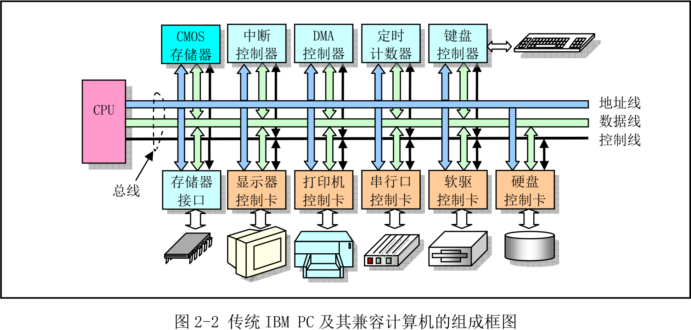
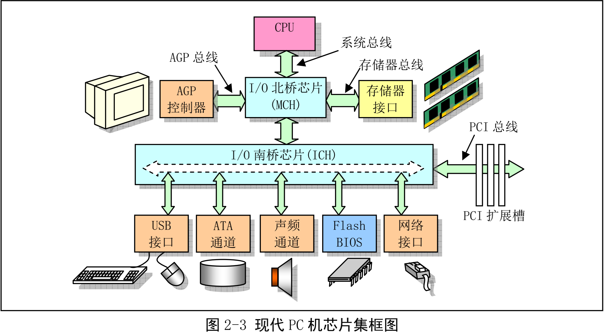
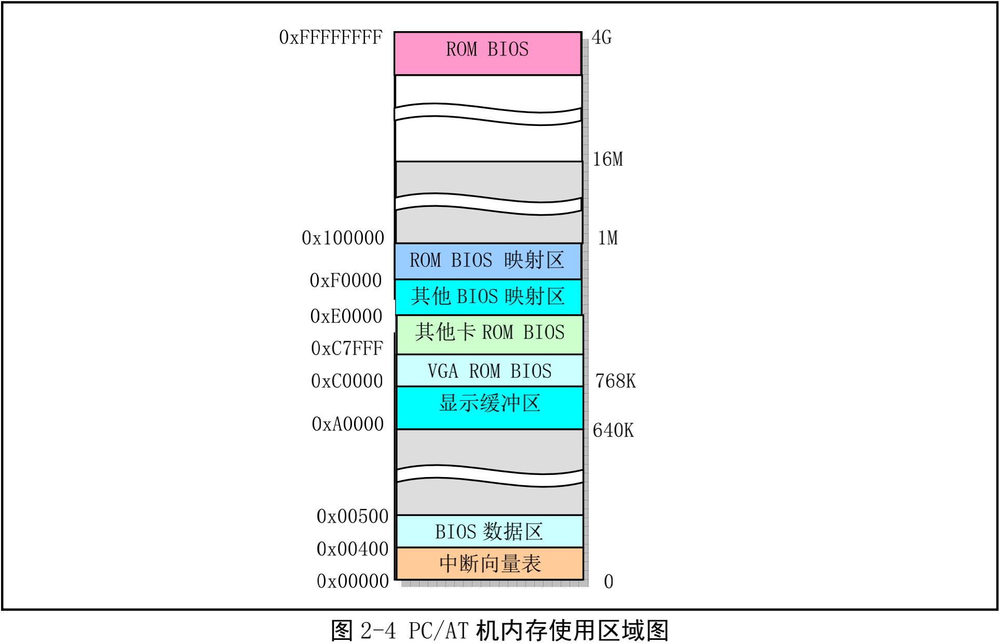
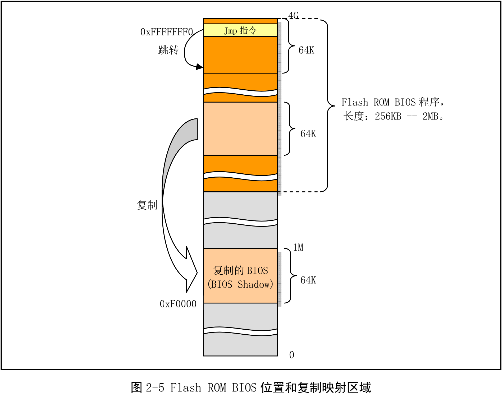

# Comments for Linux-0.11

**“RTFSC – Read The Fucking Source Code :)!”               –Linus Benedict Torvalds**

Linux 0.11版本内核只有不超过2万行的代码，尽量自己给每行代码都注释上。注释使用中文是便于自己理解。

[master](https://github.com/Eveneko/Linux-0.11/tree/master)：Linux-0.11 内核源码

[dev](https://github.com/Eveneko/Linux-0.11/tree/dev)：注释

## 第2章 微型计算机组成结构

### 2.1 微型计算机组成原理

- 80386 或以上CPU的PC机系统组成
  - 地址线（32位），数据线（32位），控制信号线；
  - 地址寻址空间 $2^{32}$ 字节，共4GB
  - 上部存储器和控制器通常集成在主板上
  - 下部控制卡（适配器）则是通过扩展插槽与主板上系统总线相连
  - 总线插槽是地址线，数据线，控制信号线和扩展设备控制器的标准连接接口；ISA，EISA，PCI，PCIE，AGP；80386只有ISA，所以只有16位数据线进行数据传输
  
- 现在，控制卡基本集成在主板上少数几个超大规模集成电路芯片中
  - 除了CPU，主板主要使用两个超大规模芯片构成的芯片组或芯片集：北桥芯片和南桥芯片
  - 北桥芯片（快）：CPU，内存，AGP
  - 南桥芯片（中，慢）：PCI，IDE，USB等
  

### 2.2 I/O端口寻址和访问控制方式

#### 2.2.1 I/O端口和寻址

- 统一编址
  - 把I/O端口地址编入存储器寻址地址空间范围内
- 独立编址
  - 把I/O控制器和控制卡的寻址空间单独作为一个独立的地址空间对待
  - IBM PC 及其兼容微机主要采用独立编址
  - 对于使用EISA或者PCI等总线结构的现代PC机，有64KB的I/O地址空间可使用。在linux下通过命令 `cat /proc/ioports` 查看

#### 2.2.2 接口访问控制

- I/O接口数据传输控制方式
  - 程序循环查询方式
    - 无硬件需求
    - 少用，除非等待时间极短或者必须
  - 中断处理方式
    - 需要中断处理器支持
    - 使用中断向量表来寻址相应的中断处理服务过程的入口地址
    - Linux大多采用这种
  - DMA传输方式
    - I/O设备与系统内存进行批量数据传送
    - 无需CPU插手
    - 无软件介入，所以效率很高

### 2.3 主存储器，BIOS 和 CMOS存储器

#### 2.3.1 主存储器

- RAM存储器，简称内存
- 现在内存从 640K 已经到了 4G
- 为了和原来的PC机在软件上兼容，系统 1M 以下物理内存分配使用保持和原来一致，只是系统ROM中基本输入输出程序BIOS一直处于CPU能寻址的最高端位置。而BIOS原来所在位置在计算机开机初始化时被用作BIOS的影子区域，即BIOS也会被复制到该区域

#### 基本输入/输出程序 BIOS

- ROM中的BIOS程序主要用于计算机开机时执行系统各部分的自检；建立系统所需的各种配置表，如中断向量表，硬盘参数表；并把处理器和系统剩余部分初始化到一个已知状态；为DOS等操作系统提供硬件设备接口服务
- BIOS提供等服务不具备可重入性（不能并发），Linux操作系统在运行时不使用BIOS中的功能。
- 32位大模式（Big Mode）把数据段访问范围设置成 4G（而非原来的 64K）

#### CMOS 存储器

- 实时时钟信息和系统硬件配置信息
- 内存和实时时钟芯片集成
- 内存地址在基本内存空间地址以外，需要I/O指令访问
